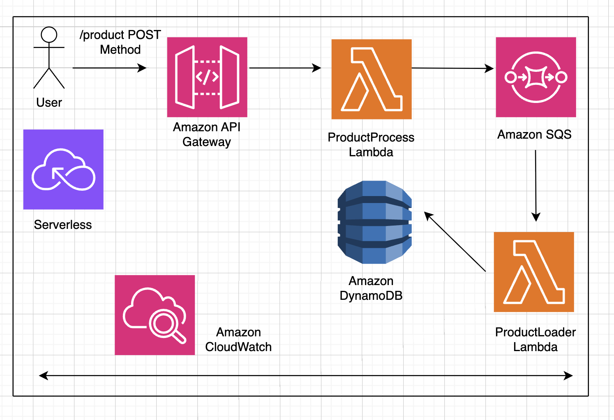

# Serverless Add Product Flow Simulator

A modern Next.js application that visually simulates an AWS serverless architecture flow for adding products. This interactive simulator demonstrates how different AWS services work together in a serverless environment to process product data asynchronously.

## Overview

This application provides a real-time visual representation of a serverless architecture workflow. When a user submits product information through the form, the application simulates the complete flow through various AWS services, including API Gateway, Lambda functions, SQS queues, DynamoDB, and SNS notifications.

## Architecture Flow Diagram



The diagram above illustrates the complete serverless architecture flow:

1. **User** - Submits product data through a web form
2. **Amazon API Gateway** - Receives and validates the HTTP POST request
3. **ProductProcess Lambda** - Processes and validates the product data
4. **Amazon SQS** - Stores messages for reliable asynchronous processing
5. **ProductLoader Lambda** - Polls the queue and processes messages
6. **Amazon DynamoDB** - Persists product data in a NoSQL database
7. **Amazon SNS** - Sends notifications confirming successful product addition

## Features

- Modern dark theme UI with Tailwind CSS
- Smooth animations using Framer Motion
- Real-time visualization of AWS serverless flow
- Interactive step-by-step progress tracking
- Responsive design for all screen sizes
- Clean component architecture
- Visual flow diagram viewer
- Success notifications with animated popups

## Tech Stack

- **Next.js 14** - React framework with App Router
- **React 18** - UI library
- **TypeScript** - Type-safe JavaScript
- **Tailwind CSS** - Utility-first CSS framework
- **Framer Motion** - Animation library for React

## Prerequisites

- Node.js 18.x or higher
- npm or yarn package manager

## Getting Started

### Installation

Clone the repository and install dependencies:

```bash
npm install
```

### Development

Start the development server:

```bash
npm run dev
```

The application will be available at [http://localhost:3006](http://localhost:3006)

### Build for Production

Build the application:

```bash
npm run build
```

Start the production server:

```bash
npm start
```

The production server will run on port 3006.

## How It Works

### User Flow

1. **Form Submission**: User fills out the product form with name, price, and details
2. **Request Processing**: Clicking "Add Product" triggers the simulated AWS flow
3. **Visual Flow**: Watch as the request moves through each AWS service in real-time
4. **Progress Tracking**: Monitor progress in the side panel with step-by-step details
5. **Completion**: Receive a success notification when the product is added to DynamoDB

### AWS Service Flow

1. **API Gateway** - Receives the HTTP request, validates it, and routes it to the appropriate backend service
2. **Lambda Function (Processing)** - Processes the request, validates the product data, and prepares it for asynchronous processing
3. **SQS Queue** - Stores the message temporarily, ensuring reliable delivery and decoupling the processing steps
4. **Lambda Function (Consumer)** - Polls the SQS queue, retrieves the message, and processes the product data
5. **DynamoDB** - Stores the product information persistently in a NoSQL database table
6. **SNS Notification** - Sends a notification to subscribers confirming the product was successfully added

## Project Structure

```
├── app/
│   ├── layout.tsx          # Root layout with metadata
│   ├── page.tsx            # Main page component
│   └── globals.css         # Global styles and Tailwind directives
├── components/
│   ├── AddProductForm.tsx  # Product form component
│   ├── FlowDiagram.tsx     # Main flow orchestrator and diagram
│   ├── AwsNode.tsx         # AWS service card component
│   └── AnimatedEdge.tsx     # Animated connection lines between services
├── public/
│   ├── images/             # AWS service icons
│   └── flow.png            # Architecture flow diagram
├── package.json            # Project dependencies and scripts
├── tailwind.config.js      # Tailwind CSS configuration
├── tsconfig.json           # TypeScript configuration
└── README.md               # Project documentation
```

## Component Details

### AddProductForm

Handles user input for product data (name, price, details) and triggers the flow simulation.

### FlowDiagram

Orchestrates the entire AWS flow simulation, managing step progression, node states, and animations. Coordinates with the parent component to update the progress panel.

### AwsNode

Displays individual AWS service cards with icons, labels, and status indicators. Supports glow effects when services are active.

### AnimatedEdge

Renders animated connections between AWS services, showing data flow direction and movement.

## Configuration

### Port Configuration

The application runs on port 3006 by default. To change this, modify the scripts in `package.json`:

```json
{
  "scripts": {
    "dev": "next dev -p YOUR_PORT",
    "start": "next start -p YOUR_PORT"
  }
}
```

### Customization

- **Colors**: Modify Tailwind colors in `tailwind.config.js`
- **Animation Timing**: Adjust delays in `components/FlowDiagram.tsx`
- **Flow Steps**: Update step descriptions in `components/FlowDiagram.tsx`

## Browser Support

- Chrome (latest)
- Firefox (latest)
- Safari (latest)
- Edge (latest)

## Development Notes

- This is a frontend-only simulation - no actual AWS calls are made
- All animations and state changes are simulated using React state and Framer Motion
- The flow diagram image can be viewed by clicking the "Show Image Diagram" button
- Reset functionality allows users to restart the flow simulation

## License

MIT License - feel free to use this project for learning and development purposes.

## Contributing

Contributions are welcome! Please feel free to submit a Pull Request.

## Acknowledgments

Built with Next.js, React, TypeScript, Tailwind CSS, and Framer Motion to demonstrate AWS serverless architecture patterns.
